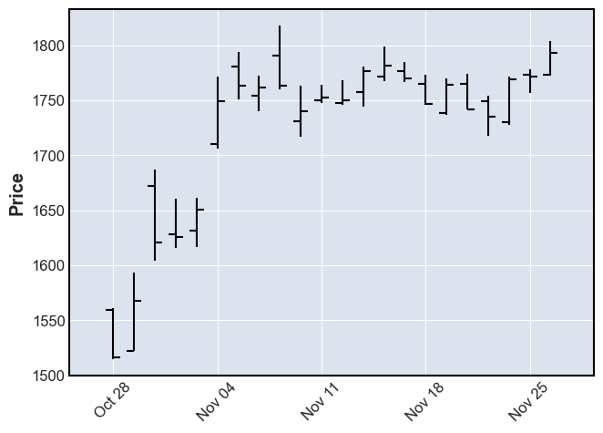
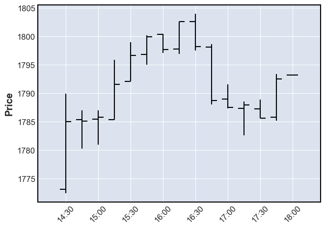
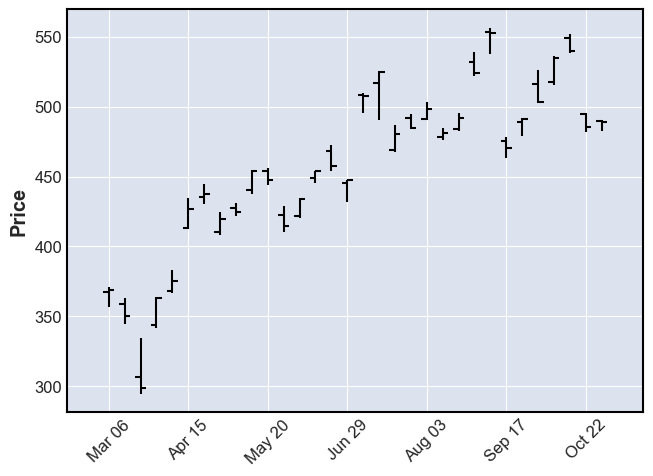
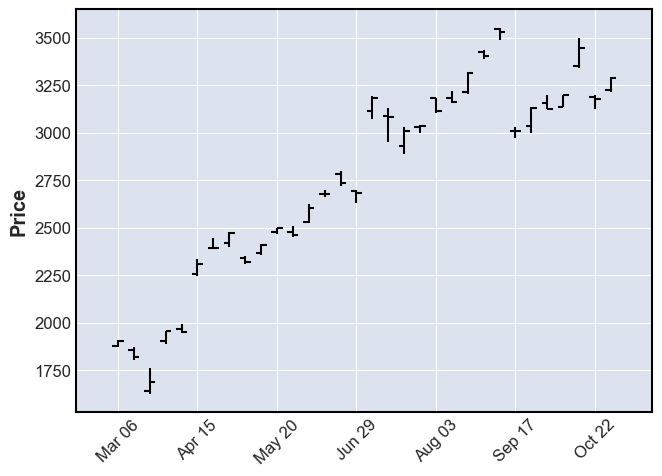
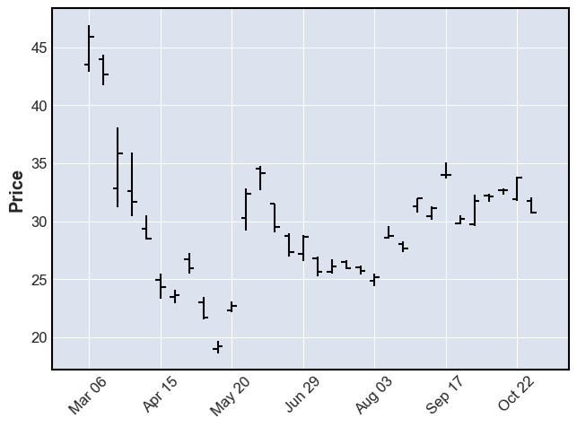
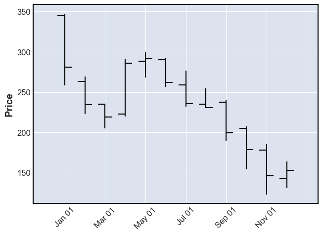
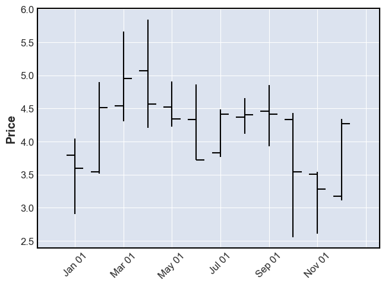
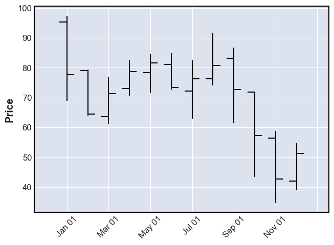
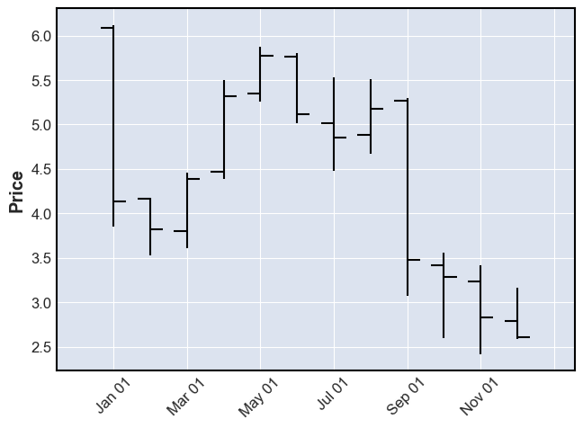

# invest

Python access to structure stock market information


To install:	```pip install invest```

- [invest](#invest)
- [Quick Start](#quick-start)
  * [ticker_symbols argument](#ticker-symbols-argument)
  * [Notes](#notes)
- [Configuring Ticker objects](#configuring-ticker-objects)
  * [Configure a Ticker instance](#configure-a-ticker-instance)
  * [Example](#example)
  * [Configure a Tickers instance](#configure-a-tickers-instance)
- [Getting (only) specific information about tickers](#getting--only--specific-information-about-tickers)
  * [Example: Historical data](#example--historical-data)
  * [Example: Specific `'info'` fields](#example--specific---info---fields)
- [Notes](#notes-1)

<small><i><a href='http://ecotrust-canada.github.io/markdown-toc/'>Table of contents generated with markdown-toc</a></i></small>


# Quick Start


```python
from invest import Tickers
```

Get a default list of tickers


```python
tickers = Tickers()
```

`tickers` is a dict-like container of tickers. So you can do dict-like things with it, like...

- ask for it's length


```python
len(tickers)
```


    4039


- list the keys


```python
list(tickers)[:5]
```


    ['EGLE', 'KMPH', 'LONG', 'CYBR', 'PTC']


- check for containment of a key


```python
'GOOG' in tickers
```


    True


The values of this dict-like object are `Ticker` instances.


```python
ticker = tickers['GOOG']
ticker
```


    Ticker('GOOG')


This `ticker` object is also dict-like. Let's see how many keys there are:


```python
len(ticker)
```


    40


What are these keys?


```python
list(ticker)
```


    ['balancesheet',
     'dividends',
     'get_sustainability',
     'get_info',
     'get_institutional_holders',
     'sustainability',
     'quarterly_balance_sheet',
     'get_balance_sheet',
     'info',
     'quarterly_earnings',
     'isin',
     'earnings',
     'history',
     'get_balancesheet',
     'get_financials',
     'balance_sheet',
     'get_earnings',
     'options',
     'splits',
     'get_recommendations',
     'get_major_holders',
     'get_dividends',
     'actions',
     'recommendations',
     'cashflow',
     'get_cashflow',
     'get_splits',
     'major_holders',
     'institutional_holders',
     'option_chain',
     'get_actions',
     'quarterly_financials',
     'get_calendar',
     'quarterly_cashflow',
     'calendar',
     'financials',
     'quarterly_balancesheet',
     'get_mutualfund_holders',
     'get_isin',
     'mutualfund_holders']


Let's look at one of these, `'info'`, which contains a dict with a bunch of information about the ticker...


```python
info = ticker['info']
print(*info, sep=', ')
```

    zip, sector, fullTimeEmployees, longBusinessSummary, city, phone, state, country, companyOfficers, website, maxAge, address1, industry, previousClose, regularMarketOpen, twoHundredDayAverage, trailingAnnualDividendYield, payoutRatio, volume24Hr, regularMarketDayHigh, navPrice, averageDailyVolume10Day, totalAssets, regularMarketPreviousClose, fiftyDayAverage, trailingAnnualDividendRate, open, toCurrency, averageVolume10days, expireDate, yield, algorithm, dividendRate, exDividendDate, beta, circulatingSupply, startDate, regularMarketDayLow, priceHint, currency, trailingPE, regularMarketVolume, lastMarket, maxSupply, openInterest, marketCap, volumeAllCurrencies, strikePrice, averageVolume, priceToSalesTrailing12Months, dayLow, ask, ytdReturn, askSize, volume, fiftyTwoWeekHigh, forwardPE, fromCurrency, fiveYearAvgDividendYield, fiftyTwoWeekLow, bid, tradeable, dividendYield, bidSize, dayHigh, exchange, shortName, longName, exchangeTimezoneName, exchangeTimezoneShortName, isEsgPopulated, gmtOffSetMilliseconds, quoteType, symbol, messageBoardId, market, annualHoldingsTurnover, enterpriseToRevenue, beta3Year, profitMargins, enterpriseToEbitda, 52WeekChange, morningStarRiskRating, forwardEps, revenueQuarterlyGrowth, sharesOutstanding, fundInceptionDate, annualReportExpenseRatio, bookValue, sharesShort, sharesPercentSharesOut, fundFamily, lastFiscalYearEnd, heldPercentInstitutions, netIncomeToCommon, trailingEps, lastDividendValue, SandP52WeekChange, priceToBook, heldPercentInsiders, nextFiscalYearEnd, mostRecentQuarter, shortRatio, sharesShortPreviousMonthDate, floatShares, enterpriseValue, threeYearAverageReturn, lastSplitDate, lastSplitFactor, legalType, lastDividendDate, morningStarOverallRating, earningsQuarterlyGrowth, dateShortInterest, pegRatio, lastCapGain, shortPercentOfFloat, sharesShortPriorMonth, category, fiveYearAverageReturn, regularMarketPrice, logo_url


```python
info['shortName']
```


    'Alphabet Inc.'


```python
info['sector']
```


    'Communication Services'


```python
df = ticker['history']
df
```


<div>
<style scoped>
    .dataframe tbody tr th:only-of-type {
        vertical-align: middle;
    }

    .dataframe tbody tr th {
        vertical-align: top;
    }

    .dataframe thead th {
        text-align: right;
    }
</style>
<table border="1" class="dataframe">
  <thead>
    <tr style="text-align: right;">
      <th></th>
      <th>Open</th>
      <th>High</th>
      <th>Low</th>
      <th>Close</th>
      <th>Volume</th>
      <th>Dividends</th>
      <th>Stock Splits</th>
    </tr>
    <tr>
      <th>Date</th>
      <th></th>
      <th></th>
      <th></th>
      <th></th>
      <th></th>
      <th></th>
      <th></th>
    </tr>
  </thead>
  <tbody>
    <tr>
      <th>2020-10-28</th>
      <td>1559.739990</td>
      <td>1561.349976</td>
      <td>1514.619995</td>
      <td>1516.619995</td>
      <td>1834000</td>
      <td>0</td>
      <td>0</td>
    </tr>
    <tr>
      <th>2020-10-29</th>
      <td>1522.359985</td>
      <td>1593.709961</td>
      <td>1522.239990</td>
      <td>1567.239990</td>
      <td>2003100</td>
      <td>0</td>
      <td>0</td>
    </tr>
    <tr>
      <th>2020-10-30</th>
      <td>1672.109985</td>
      <td>1687.000000</td>
      <td>1604.459961</td>
      <td>1621.010010</td>
      <td>4329100</td>
      <td>0</td>
      <td>0</td>
    </tr>
    <tr>
      <th>2020-11-02</th>
      <td>1628.160034</td>
      <td>1660.770020</td>
      <td>1616.030029</td>
      <td>1626.030029</td>
      <td>2535400</td>
      <td>0</td>
      <td>0</td>
    </tr>
    <tr>
      <th>2020-11-03</th>
      <td>1631.780029</td>
      <td>1661.699951</td>
      <td>1616.619995</td>
      <td>1650.209961</td>
      <td>1661700</td>
      <td>0</td>
      <td>0</td>
    </tr>
    <tr>
      <th>2020-11-04</th>
      <td>1710.280029</td>
      <td>1771.364990</td>
      <td>1706.030029</td>
      <td>1749.130005</td>
      <td>3570900</td>
      <td>0</td>
      <td>0</td>
    </tr>
    <tr>
      <th>2020-11-05</th>
      <td>1781.000000</td>
      <td>1793.640015</td>
      <td>1750.510010</td>
      <td>1763.369995</td>
      <td>2065800</td>
      <td>0</td>
      <td>0</td>
    </tr>
    <tr>
      <th>2020-11-06</th>
      <td>1753.949951</td>
      <td>1772.430054</td>
      <td>1740.349976</td>
      <td>1761.750000</td>
      <td>1660900</td>
      <td>0</td>
      <td>0</td>
    </tr>
    <tr>
      <th>2020-11-09</th>
      <td>1790.900024</td>
      <td>1818.060059</td>
      <td>1760.020020</td>
      <td>1763.000000</td>
      <td>2268300</td>
      <td>0</td>
      <td>0</td>
    </tr>
    <tr>
      <th>2020-11-10</th>
      <td>1731.089966</td>
      <td>1763.000000</td>
      <td>1717.300049</td>
      <td>1740.390015</td>
      <td>2636100</td>
      <td>0</td>
      <td>0</td>
    </tr>
    <tr>
      <th>2020-11-11</th>
      <td>1750.000000</td>
      <td>1764.219971</td>
      <td>1747.364990</td>
      <td>1752.709961</td>
      <td>1264000</td>
      <td>0</td>
      <td>0</td>
    </tr>
    <tr>
      <th>2020-11-12</th>
      <td>1747.630005</td>
      <td>1768.270020</td>
      <td>1745.599976</td>
      <td>1749.839966</td>
      <td>1247500</td>
      <td>0</td>
      <td>0</td>
    </tr>
    <tr>
      <th>2020-11-13</th>
      <td>1757.630005</td>
      <td>1781.040039</td>
      <td>1744.550049</td>
      <td>1777.020020</td>
      <td>1499900</td>
      <td>0</td>
      <td>0</td>
    </tr>
    <tr>
      <th>2020-11-16</th>
      <td>1771.699951</td>
      <td>1799.069946</td>
      <td>1767.689941</td>
      <td>1781.380005</td>
      <td>1246800</td>
      <td>0</td>
      <td>0</td>
    </tr>
    <tr>
      <th>2020-11-17</th>
      <td>1776.939941</td>
      <td>1785.000000</td>
      <td>1767.000000</td>
      <td>1770.150024</td>
      <td>1147100</td>
      <td>0</td>
      <td>0</td>
    </tr>
    <tr>
      <th>2020-11-18</th>
      <td>1765.229980</td>
      <td>1773.469971</td>
      <td>1746.140015</td>
      <td>1746.780029</td>
      <td>1173500</td>
      <td>0</td>
      <td>0</td>
    </tr>
    <tr>
      <th>2020-11-19</th>
      <td>1738.380005</td>
      <td>1769.589966</td>
      <td>1737.005005</td>
      <td>1763.920044</td>
      <td>1249900</td>
      <td>0</td>
      <td>0</td>
    </tr>
    <tr>
      <th>2020-11-20</th>
      <td>1765.209961</td>
      <td>1774.000000</td>
      <td>1741.859985</td>
      <td>1742.189941</td>
      <td>2313500</td>
      <td>0</td>
      <td>0</td>
    </tr>
    <tr>
      <th>2020-11-23</th>
      <td>1749.599976</td>
      <td>1753.900024</td>
      <td>1717.719971</td>
      <td>1734.859985</td>
      <td>2161600</td>
      <td>0</td>
      <td>0</td>
    </tr>
    <tr>
      <th>2020-11-24</th>
      <td>1730.500000</td>
      <td>1771.599976</td>
      <td>1727.689941</td>
      <td>1768.880005</td>
      <td>1578000</td>
      <td>0</td>
      <td>0</td>
    </tr>
    <tr>
      <th>2020-11-25</th>
      <td>1772.890015</td>
      <td>1778.540039</td>
      <td>1756.540039</td>
      <td>1771.430054</td>
      <td>1045800</td>
      <td>0</td>
      <td>0</td>
    </tr>
    <tr>
      <th>2020-11-27</th>
      <td>1773.089966</td>
      <td>1804.000000</td>
      <td>1772.439941</td>
      <td>1793.189941</td>
      <td>884900</td>
      <td>0</td>
      <td>0</td>
    </tr>
  </tbody>
</table>
</div>


```python
from mplfinance import plot as candlestick_plot  # pip install mplfinance if you don't have it already

candlestick_plot(df)
```


    

    


But these are daily metrics and only for the recent (yes, I'm doing this on a Thanksgiving week-end!) past.

How do I get something different? Like a longer history, and/or at a finer time-granularity?

See the next _Configuring Ticker objects_ section on how to do that.

## ticker_symbols argument

The first argument of `Tickers` is the `ticker_symbols` argument. 

One can specify a collection (list, set, tuple, etc.) of ticker symbol strings, or a path to a file containing a pickle of such a collection.

The default is the string `'local_list'` which has the effect of using a default list (currently of about 4000 tickers), but it's contents can change in the future. 

Note that this `ticker_symbols` will have an effect on such affairs as `list(tickers)`, `len(tickers)`, or `s in tickers`, when it's relevant to use these. 

But any `Tickers` object will allow access to any ticker symbol, regardless if it's in the `ticker_symbols` collection or not.


```python
tickers = Tickers(ticker_symbols=('GOOG', 'AAPL', 'AMZN'))
assert list(tickers) == ['GOOG', 'AAPL', 'AMZN']
assert len(tickers) == 3
assert 'AAPL' in tickers
assert 'NFLX' not in tickers
# and yet we have access to NFLX info
assert tickers['NFLX']['info']['shortName'] == 'Netflix, Inc.'
```


```python

```

## Notes

- Both `Tickers` and `Ticker` instances have tab-triggered auto-suggestion enabled when you get an item. Example: `tickers['AA<now press the TAB button...>`.
- The specification of 


```python

```

# Configuring Ticker objects

## Configure a Ticker instance

You can instantiate a `Ticker` instance directly, from **any valid ticker symbol**. The `Tickers` class is just a way to make a collection of tickers to work with. 


```python
from invest import Tickers, Ticker

ticker = Ticker('GOOG')
ticker
```


    Ticker('GOOG')


But you'll notice that `Ticker` (and `Tickers`) have more than one argument. 


```python
from inspect import signature
print(signature(Tickers))
print(signature(Ticker))
```

    (ticker_symbols='local_list', **kwargs_for_method_keys)
    (ticker_symbol: str, **kwargs_for_method_keys)


What's this `kwargs_for_method_keys`?

Well, at the time of writing this, `Ticker` object is just a convenient dict-like interface to the attributes of the `Ticker` of the `yfinance` package which is itself a convenient python interface to the yahoo finance API. 

When you do `list(ticker)`, you're just getting a list of attributes of `yfinance.Ticker`: Both properties and methods that don't require any arguments. Though these methods don't require any arguments -- meaning all their arguments have defaults -- you can still specify if you want to use different defaults. 

That's where `kwargs_for_method_keys` comes in. It specifies what `arg=val` pairs that should be used for particular methods of `yfinance.Ticker`. 

If you want to know more about what you can do with the `Ticker` object, you might want to check out `yfinance`'s and yahoo finance API's documentation.

For the basics though, `invest` provides the `help_me_with` function (as a standalone function or as a method in `Tickers` and `Ticker`) for quick access to essentials.


```python
Ticker.help_me_with('history')
```

    history
    wraps <function TickerBase.history at 0x11a064940>, whose signature is:
    (self, period='1mo', interval='1d', start=None, end=None, prepost=False, actions=True, auto_adjust=True, back_adjust=False, proxy=None, rounding=False, tz=None, **kwargs)
    
            :Parameters:
                period : str
                    Valid periods: 1d,5d,1mo,3mo,6mo,1y,2y,5y,10y,ytd,max
                    Either Use period parameter or use start and end
                interval : str
                    Valid intervals: 1m,2m,5m,15m,30m,60m,90m,1h,1d,5d,1wk,1mo,3mo
                    Intraday data cannot extend last 60 days
                start: str
                    Download start date string (YYYY-MM-DD) or _datetime.
                    Default is 1900-01-01
                end: str
                    Download end date string (YYYY-MM-DD) or _datetime.
                    Default is now
                prepost : bool
                    Include Pre and Post market data in results?
                    Default is False
                auto_adjust: bool
                    Adjust all OHLC automatically? Default is True
                back_adjust: bool
                    Back-adjusted data to mimic true historical prices
                proxy: str
                    Optional. Proxy server URL scheme. Default is None
                rounding: bool
                    Round values to 2 decimal places?
                    Optional. Default is False = precision suggested by Yahoo!
                tz: str
                    Optional timezone locale for dates.
                    (default data is returned as non-localized dates)
                **kwargs: dict
                    debug: bool
                        Optional. If passed as False, will suppress
                        error message printing to console.
            
    


## Example

Here's you can get `history` to give you something different. 

Say, get data for the last day, with a granularity of 15 minutes.


```python
ticker = Ticker('GOOG', history=dict(period='1d', interval='15m'))
ticker
```


    Ticker('GOOG', history={'period': '1d', 'interval': '15m'})


Your ticker is almost identical to the previous one we made, or the one we got from `Tickers`, except for the fact that asking for `ticker['history']` is going to give you something different.


```python
df = ticker['history']
df
```


<div>
<style scoped>
    .dataframe tbody tr th:only-of-type {
        vertical-align: middle;
    }

    .dataframe tbody tr th {
        vertical-align: top;
    }

    .dataframe thead th {
        text-align: right;
    }
</style>
<table border="1" class="dataframe">
  <thead>
    <tr style="text-align: right;">
      <th></th>
      <th>Open</th>
      <th>High</th>
      <th>Low</th>
      <th>Close</th>
      <th>Volume</th>
      <th>Dividends</th>
      <th>Stock Splits</th>
    </tr>
    <tr>
      <th>Datetime</th>
      <th></th>
      <th></th>
      <th></th>
      <th></th>
      <th></th>
      <th></th>
      <th></th>
    </tr>
  </thead>
  <tbody>
    <tr>
      <th>2020-11-27 09:30:00-05:00</th>
      <td>1773.089966</td>
      <td>1789.890015</td>
      <td>1772.439941</td>
      <td>1785.000000</td>
      <td>119289</td>
      <td>0</td>
      <td>0</td>
    </tr>
    <tr>
      <th>2020-11-27 09:45:00-05:00</th>
      <td>1785.380005</td>
      <td>1786.979980</td>
      <td>1780.229980</td>
      <td>1785.089966</td>
      <td>50660</td>
      <td>0</td>
      <td>0</td>
    </tr>
    <tr>
      <th>2020-11-27 10:00:00-05:00</th>
      <td>1785.489990</td>
      <td>1786.989990</td>
      <td>1780.959961</td>
      <td>1785.800049</td>
      <td>50797</td>
      <td>0</td>
      <td>0</td>
    </tr>
    <tr>
      <th>2020-11-27 10:15:00-05:00</th>
      <td>1785.319946</td>
      <td>1795.925049</td>
      <td>1785.319946</td>
      <td>1791.589966</td>
      <td>72146</td>
      <td>0</td>
      <td>0</td>
    </tr>
    <tr>
      <th>2020-11-27 10:30:00-05:00</th>
      <td>1792.060059</td>
      <td>1798.999878</td>
      <td>1792.060059</td>
      <td>1796.699951</td>
      <td>48097</td>
      <td>0</td>
      <td>0</td>
    </tr>
    <tr>
      <th>2020-11-27 10:45:00-05:00</th>
      <td>1796.800049</td>
      <td>1800.199951</td>
      <td>1795.060059</td>
      <td>1799.959961</td>
      <td>56292</td>
      <td>0</td>
      <td>0</td>
    </tr>
    <tr>
      <th>2020-11-27 11:00:00-05:00</th>
      <td>1800.359985</td>
      <td>1800.449951</td>
      <td>1797.130005</td>
      <td>1797.660034</td>
      <td>41882</td>
      <td>0</td>
      <td>0</td>
    </tr>
    <tr>
      <th>2020-11-27 11:15:00-05:00</th>
      <td>1797.819946</td>
      <td>1802.599976</td>
      <td>1796.949951</td>
      <td>1802.579956</td>
      <td>60333</td>
      <td>0</td>
      <td>0</td>
    </tr>
    <tr>
      <th>2020-11-27 11:30:00-05:00</th>
      <td>1802.579956</td>
      <td>1804.000000</td>
      <td>1797.550049</td>
      <td>1798.185059</td>
      <td>45667</td>
      <td>0</td>
      <td>0</td>
    </tr>
    <tr>
      <th>2020-11-27 11:45:00-05:00</th>
      <td>1798.099976</td>
      <td>1798.603027</td>
      <td>1788.000000</td>
      <td>1788.739990</td>
      <td>47900</td>
      <td>0</td>
      <td>0</td>
    </tr>
    <tr>
      <th>2020-11-27 12:00:00-05:00</th>
      <td>1789.000000</td>
      <td>1791.599976</td>
      <td>1787.329956</td>
      <td>1787.500000</td>
      <td>36459</td>
      <td>0</td>
      <td>0</td>
    </tr>
    <tr>
      <th>2020-11-27 12:15:00-05:00</th>
      <td>1787.347534</td>
      <td>1788.530029</td>
      <td>1782.574951</td>
      <td>1787.952759</td>
      <td>46400</td>
      <td>0</td>
      <td>0</td>
    </tr>
    <tr>
      <th>2020-11-27 12:30:00-05:00</th>
      <td>1787.260010</td>
      <td>1788.920044</td>
      <td>1785.640015</td>
      <td>1785.640015</td>
      <td>45660</td>
      <td>0</td>
      <td>0</td>
    </tr>
    <tr>
      <th>2020-11-27 12:45:00-05:00</th>
      <td>1785.829956</td>
      <td>1793.420044</td>
      <td>1785.219971</td>
      <td>1792.520020</td>
      <td>97273</td>
      <td>0</td>
      <td>0</td>
    </tr>
    <tr>
      <th>2020-11-27 13:00:00-05:00</th>
      <td>1793.189941</td>
      <td>1793.189941</td>
      <td>1793.189941</td>
      <td>1793.189941</td>
      <td>46982</td>
      <td>0</td>
      <td>0</td>
    </tr>
  </tbody>
</table>
</div>


```python
from mplfinance import plot as candlestick_plot  # pip install mplfinance if you don't have it already

candlestick_plt(df)
```


    

    


## Configure a Tickers instance

Let's say we wanted all ticker instances that `Tickers` gives us to have their `history` be over a specific interval of time in the past (say, during the 2020 pandemic), at 5 day intervals...


```python
tickers = Tickers(ticker_symbols={'NFLX', 'AMZN', 'DAL'},  # demoing the fact that we can specify an explicit collection of ticker symbols
                  history=dict(start='2020-03-01', end='2020-10-31', interval='5d'))
list(tickers)
```


    ['DAL', 'AMZN', 'NFLX']


See that indeed, all tickers given by `tickers` are configured according to our wishes.


```python
tickers['NFLX']
```


    Ticker('NFLX', history={'start': '2020-03-01', 'end': '2020-10-31', 'interval': '5d'})


```python
from mplfinance import plot as candlestick_plot  # pip install mplfinance if you don't have it already

candlestick_plot(tickers['NFLX']['history'])
```


    

    


```python
candlestick_plot(tickers['AMZN']['history'])
```


    

    


So Netflix and Amazon did well. 

Delta, less so:


```python
candlestick_plot(tickers['DAL']['history'])
```


    

    


# Getting (only) specific information about tickers

`Tickers` and `Ticker` are convenient if you want to analyze several aspects of a ticker since you can poke around the various keys (e.g. `info`, `history`, etc.). 

But if a particular analysis only needs one of these, it's more convenient to use `TickersWithSpecificInfo`, 
which gives you the same interface as `Tickers` (in fact, it's a subclass if `Tickers`), 
but fixes the key.

## Example: Historical data

For example, if you're only interested in the historical data (a.k.a. the `'history'` key), you might do this:


```python
from invest import TickersWithSpecificInfo

tickers = TickersWithSpecificInfo(specific_key='history', start='2008-01-01', end='2009-01-01', interval='1mo')  # 2008 historical data, month granularity
tickers
```


    TickersWithSpecificInfo(ticker_symbols=<local_list>, specific_key=history, start=2008-01-01, end=2009-01-01, interval=1mo)


```python
candlestick_plot(tickers['GOOG'])
```


    

    


```python
candlestick_plot(tickers['NFLX'])
```


    

    


```python
candlestick_plot(tickers['AMZN'])
```


    

    


```python
candlestick_plot(tickers['AAPL'])
```


    

    


## Example: Specific `'info'` fields


```python
from invest import TickersWithSpecificInfo

the_info_that_i_want = ['shortName', 'sector', 'earningsQuarterlyGrowth', 'sharesShortPriorMonth']
tickers = TickersWithSpecificInfo(specific_key='info', val_trans=lambda d: {k: d[k] for k in the_info_that_i_want}) 
tickers
```


    TickersWithSpecificInfo(ticker_symbols=<local_list>, specific_key=info, val_trans=<function <lambda> at 0x11c2374c0>)


Now, you won't get the overwhelming amount of information you usually get with `info`:


```python
tickers['AAPL']
```


    {'shortName': 'Apple Inc.',
     'sector': 'Technology',
     'earningsQuarterlyGrowth': -0.074,
     'sharesShortPriorMonth': 83252522}


```python
faang_tickers = ('FB', 'AMZN', 'AAPL', 'NFLX', 'GOOG')
the_info_that_i_want = ['shortName', 'sector', 'earningsQuarterlyGrowth', 'sharesShortPriorMonth']
tickers = TickersWithSpecificInfo(faang_tickers, specific_key='info', val_trans=lambda d: {k: d[k] for k in the_info_that_i_want}) 
tickers
```


    TickersWithSpecificInfo(ticker_symbols=('FB', 'AMZN', 'AAPL', 'NFLX', 'GOOG'), specific_key=info, val_trans=<function <lambda> at 0x11c237a60>)


```python
info_df = pd.DataFrame(list(tickers.values()))
info_df
```


<div>
<style scoped>
    .dataframe tbody tr th:only-of-type {
        vertical-align: middle;
    }

    .dataframe tbody tr th {
        vertical-align: top;
    }

    .dataframe thead th {
        text-align: right;
    }
</style>
<table border="1" class="dataframe">
  <thead>
    <tr style="text-align: right;">
      <th></th>
      <th>shortName</th>
      <th>sector</th>
      <th>earningsQuarterlyGrowth</th>
      <th>sharesShortPriorMonth</th>
    </tr>
  </thead>
  <tbody>
    <tr>
      <th>0</th>
      <td>Facebook, Inc.</td>
      <td>Communication Services</td>
      <td>0.288</td>
      <td>21187652</td>
    </tr>
    <tr>
      <th>1</th>
      <td>Amazon.com, Inc.</td>
      <td>Consumer Cyclical</td>
      <td>1.967</td>
      <td>2509939</td>
    </tr>
    <tr>
      <th>2</th>
      <td>Apple Inc.</td>
      <td>Technology</td>
      <td>-0.074</td>
      <td>83252522</td>
    </tr>
    <tr>
      <th>3</th>
      <td>Netflix, Inc.</td>
      <td>Communication Services</td>
      <td>0.187</td>
      <td>9416477</td>
    </tr>
    <tr>
      <th>4</th>
      <td>Alphabet Inc.</td>
      <td>Communication Services</td>
      <td>0.591</td>
      <td>2381334</td>
    </tr>
  </tbody>
</table>
</div>


# Notes

- Though `Tickers` allows you to deal with a collection of tickers, it does so (for time being) by calling yahoo's API for each individual ticker. The API does, on the other hand, contain some bulk tickers routes which we intend to integrate.


